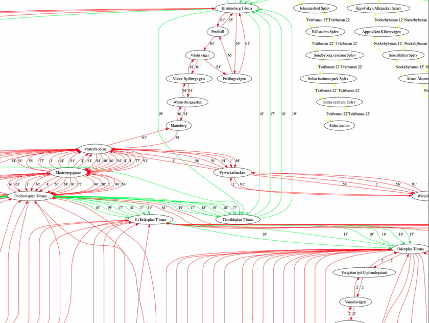

# travel-planner
using graph traversal algorithm A-star, fastest routes between starting and end destination is calculated. Data is from Stockholms Lokaltrafik. With this implementation of A-star algorithm we can find the fastest route between two destinations based on data from a given day. 

The data from the selected day is stored in the "datafiles" folder. In the datafiles folder the name of the stations can be found aswell. 

     
Example from running the program:   

  

